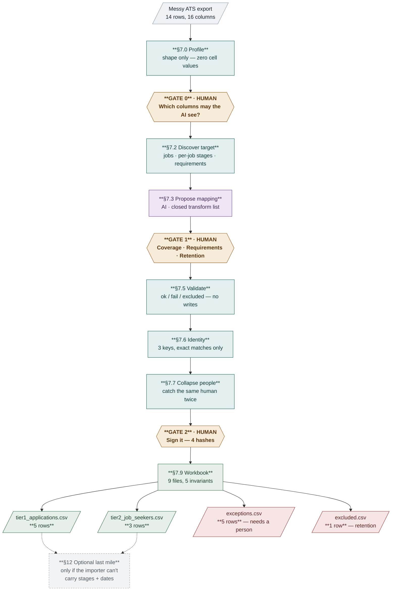
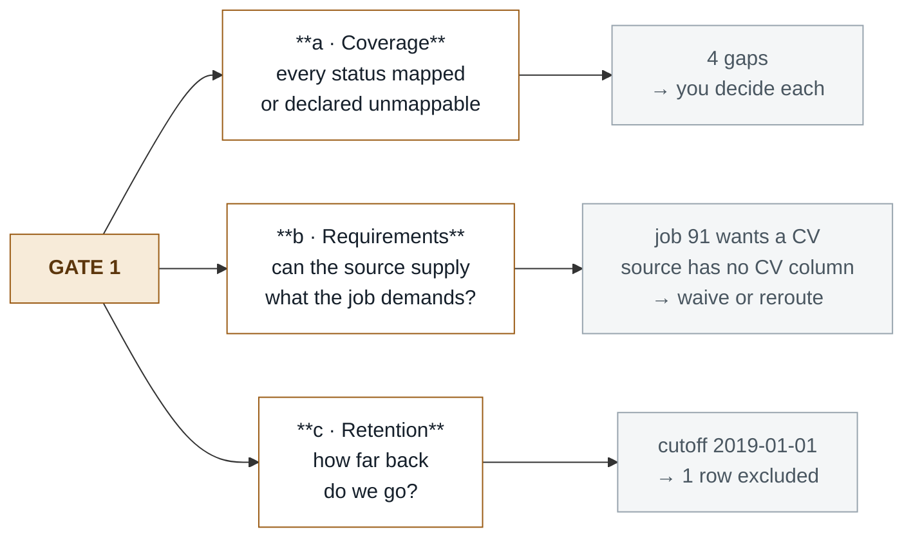
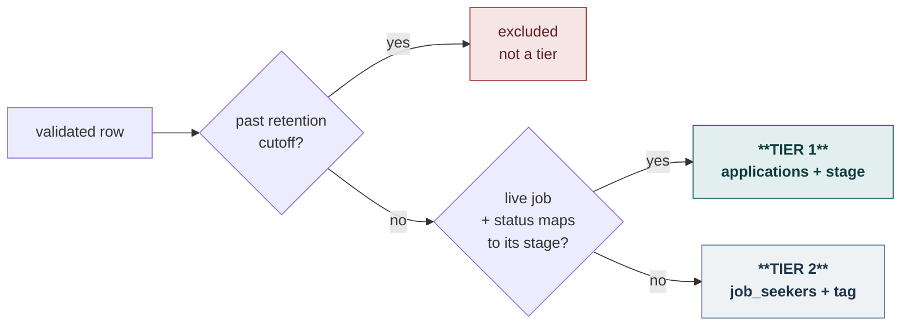
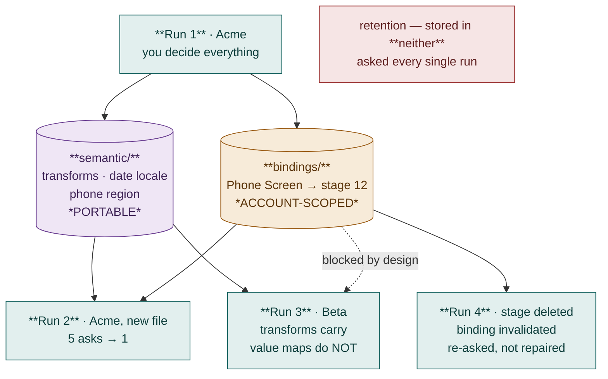

# Migration Copilot — Demo Script

**Runtime: ~8 min** · 14 rows · 7 stages · 3 human gates · 2 tiers · 0 writes by the model

---

## The whole thing in one picture



> **The one line that explains the design:** software does the reading, checking and counting; a human makes every decision that could be wrong in a way that matters.

---

## Scene 1 · Setup

```bash
cd /Users/fazal/Desktop/PinPoint/demo && ../.venv/bin/python run_demo.py --forget
```

> *"A customer joins Pinpoint carrying a spreadsheet from their old system. Someone has to turn it into records. The expensive mistakes aren't technical — they're creating the same person twice, emailing someone who applied in 2019, or importing people the customer has no right to keep."*

`--forget` wipes the tool's memory, so this is a cold start. It pauses between stages — **press Enter to advance.**

---

## Scene 2 · Profile — read the shape, not the contents

**Screen shows:**
```
rows=14  columns=16
anomalies: ["duplicate header 'notes'", '2 trailing junk rows discarded', 'BOM present, stripped']
'Notes' appears at indices [13, 15]
distinct values emitted: False  ← none, by design
```

> *"It has read the file's shape — but not a single value. Columns are tracked by position, not name, because there are two columns called 'Notes' and name-matching would silently grab the wrong one."*

---

## Scene 3 · GATE 0 — the privacy decision 🔴 *first live input*

**Type this first — deliberately wrong:**
```
4,3,12,1
```

**Screen shows:**
```
GATE 0 REJECTED — the tripwire found forbidden patterns:
   ✗ column 'E-mail Address' matches pattern 'email'
```

> *"I just asked to show the AI the email column, and it refused. Notice what the error doesn't contain — the email itself. It names the column, never the value."*

**Now type the real answer:**
```
4,3,12
```

→ Status, Applied For, Source. **Those word lists are the only cell contents the AI will ever see.**

---

## Scene 4 · Discover + AI proposal

**Screen shows:**
```
job  88 Graduate Scheme 2024   open   require_phone=True   cv=optional
job  91 Senior Data Engineer   open   require_phone=False  cv=required
         stages: Applied(30,workflow) … Take-home(91001,job)
```

> *"Job 91's Take-home stage belongs to the job, not the workflow. Look only at the workflow and you generate a stage number that doesn't exist on that job."*

Then the AI proposes the mapping — picking from a fixed menu of transforms, never writing code:

```
col  5 Applied Date  → custom_attribute  parse_date locale=en_GB
```

> *"The file contains 04/03/2019 — either 4 March or 3 April. No software can tell you which. So the date format has no default: the spec won't validate until a human picks. It gets decided, on the record, instead of guessed."*

---

## Scene 5 · GATE 1 — the big one 🔴 *live input × 6*



**Type in order:**

| Prompt | Type | Why |
|---|---|---|
| `Final` → stage or `u` | `16` | Show a *real* mapping choice — this moves a person into Tier 1 |
| `Take-home` → stage or `u` | `u` | No matching stage on this job |
| `Technical Screen` → stage or `u` | `u` | Same |
| `Phone Screen` (job 91) → stage or `u` | `u` | Job 91's workflow has no phone screen |
| waive or rebind | `w` | One mapping problem, not 800 row problems |
| retention cutoff | `2019-01-01` | |

> *"That CV question is the interesting one. Job 91 requires a CV and the file has no CV column at all — so every row for that job fails identically. That's one problem with the mapping, not a hundred problems with the data. It gets raised here, once, where a human can act on it."*

> *"And retention is a hard block. A fourteen-year export contains people the customer may have no lawful basis to keep. This is the one gate where the right answer is sometimes 'import less.'"*

---

## Scene 6 · Validate — three outcomes, never "warn and proceed"

**Screen shows:**
```
verdicts: {'ok': 11, 'fail': 2, 'excluded': 1}    tiers: {1: 10, 2: 3, None: 1}

 ✗ row  3  T1  ADDRESS2_ON_US
 ✗ row  8  T1  MISSING_REQUIRED_PHONE
 — row 14  --  BEFORE_RETENTION_CUTOFF
```

> *"Pinpoint's own docs say the API will not check required fields — that's the client's job. Without this stage you create thousands of incomplete applications the API happily accepts."*

> *"And because you covered every status at Gate 1, no row can be dropped here for a decision you were never asked to make."*

**The tier rule, in full:**



> *"A tier is a destination, not a ranking. Pinpoint lets you create exactly two things — an application, which needs a job, and a job seeker, which doesn't. Tier 2 isn't worse data. It's data with nowhere to hang an application."*

---

## Scene 7 · Identity — three questions, zero guessing 🔴 *live input × 2*

**Screen shows:**
```
row  2  existing_person            candidate=9001
row 10  ambiguous_multiple_match   conflict={"phone": [9003, 9004]}
row 11  conflicting_keys           conflict={"esr": [9005], "email": [9001]}
row 13  duplicate_source_row
```

**Type `d` twice** (defer both to the workbook).

> *"One phone number matches two different people. One row's legacy ID and email point at different humans. It doesn't guess — 'probably the same person' is a data-protection incident, not a convenience."*

**Then the catch that running it found:**
```
row 12 shares person_key with row 1 → must WAIT and reuse the returned candidate id
7 distinct people across 8 rows
```

> *"Ada Lovelace appears twice under two record IDs — a genuine re-applicant. Pinpoint has no way to create a person directly; a person appears as a side effect of creating an application. So without this check, you get two Adas. This bug was found by running the spec, not by reading it."*

---

## Scene 8 · GATE 2 — the signature 🔴 *live input × 3*

**Type:** `approve` → your name → `y`

**Screen shows:**
```
plan_hash          sha256:43e5b9e89500d337
mapping_hash       sha256:d33473b164e9cbf8
vocabulary_hash    sha256:0fd6ca590bd1a3da
source_sha256      83c8952a481979b9

changed parse_date.locale: en_GB → en_US
approval mapping_hash   sha256:d33473b164e9cbf8
recomputed mapping_hash sha256:a6f2a66505fcb4bd
→ MISMATCH — approval VOID, the run refuses to start
```

> *"Enter alone won't do it — you type the word 'approve'. Then it fingerprints the source file, the mapping, the vocabulary and the plan. Change one setting afterwards and the approval is void. That's why the sign-off is hashes in a file and not a status field somebody could edit."*

---

## Scene 9 · The workbook — the actual deliverable

**Screen shows:**
```
workbook/
  README.md                          859 bytes
  manifest.json                     2091 bytes
  tier1_applications.csv    5 rows    857 bytes
  tier2_job_seekers.csv     3 rows    673 bytes
  exceptions.csv            5 rows    574 bytes
  excluded.csv              1 rows     89 bytes
  identity_report.csv       8 rows    383 bytes
  decisions.json                    1166 bytes
  not_preserved.md                   234 bytes

invariants:
 PASS  source_rows = excluded + failed + queued + tier1 + tier2   14 == 1+2+3+5+3
 PASS  distinct_person_keys = people_new + people_matched         7 == 6+1
 PASS  tier1_rows = rows(tier1_applications.csv)                  5
 PASS  tier2_rows = rows(tier2_job_seekers.csv)                   3
 PASS  queued = rows(exceptions.csv) - failed_validation          3 == 5-2
```

> *"Import-ready CSVs with an import order that stops the duplicate-Ada problem. An exceptions file with the rows a human still owns — carrying the real data, because you can't resolve an identity question without seeing it. A decisions log with a name on it. A plain statement of what can't be preserved. And counts that must balance — if the arithmetic doesn't add up, that's a bug, not a rounding error."*

**Optionally open one:**
```bash
cat workbook/tier1_applications.csv | cut -d, -f1-9
```

---

## Scene 10 · The optional last mile

**Type `y` at the final prompt.**

```
row  9 applications  → unknown    response lost after send
row  9 → queried by external_system_reference → already committed, id=20007
applications on server before=5 after=5 → no duplicate created
```

> *"One response gets lost mid-run. On resume it asks the server what actually happened before retrying — a timeout is not evidence of failure. And this whole section only needs to exist if Pinpoint's own importer can't carry stages and dates. That's the top open question in the spec: a 'yes' deletes the largest chunk of it."*

---

## Scene 11 · The learning loop

```bash
cd /Users/fazal/Desktop/PinPoint/demo && ../.venv/bin/python run_learning.py
```



**Screen shows:**
```
  scenario                              sem  bind  model  reuse  ask  stale   auto
  1. Cold start                           -     -      6      0    5      0    54%
  2. Same account, new file             YES   YES      6      4    1      0    90%
  3. New account, same file shape       YES     -      6      0    4      0    60%
  4. Same account, a stage was retired  YES   YES      5      5    1      2    90%
```

> *"Row 2 — same customer, another export. Five decisions become one, and the one left is a status that genuinely never appeared before."*

> *"Row 3 is the important one. A different customer keeps the knowledge about the file and deliberately loses the knowledge about the account. Replaying 'Phone Screen means stage 12' into another company points at a completely different job. That's a safety feature wearing a limitation's clothes."*

> *"Row 4 — someone deleted a stage since last time. The remembered answer is thrown away and re-asked, never quietly patched. A stage ID that silently moved is how a migration lands people in the wrong pipeline."*

> *"And retention is in no column. It's asked every run, by design."*

---

## Closing — three things worth saying

**Where the AI is, and isn't.**

| Used for | Not used for | Why not |
|---|---|---|
| Proposing the mapping | Identity matching | "Probably the same person" is a privacy incident |
| Drafting the summary from counts | Transforming values | A date library with a declared locale beats a model every time |
| | Writing to the API | A model shouldn't hold a tool that makes irreversible changes |
| | Tier routing | It's a three-line rule; a model makes it non-reproducible |

> *"The test I applied: would a wrong answer be caught before it reached a human? For the mapping, yes — a person reviews it next. For identity, no."*

**Two findings came from running it, not reading it** — the duplicate-person bug and a routing bug that silently discarded rows. The spec was wrong on paper both times.

**On n8n.** The core doesn't fit a workflow canvas: gates measured in days, and n8n stores every node's data by default — exactly where candidate records must not sit. Where it *does* fit: the ticket work around the migration — intake, chasing the customer for missing columns, pinging the engineer when a gate has been waiting.

---

## Cheat sheet

```bash
# Full interactive walkthrough, cold start
../.venv/bin/python run_demo.py --forget

# No pauses between stages (faster demo)
../.venv/bin/python run_demo.py --forget --no-pause

# Hands-off, recorded answers — good for a rehearsal
../.venv/bin/python run_demo.py --auto

# Stop at the workbook, skip the API section
../.venv/bin/python run_demo.py --no-execute

# The learning curve, four runs
../.venv/bin/python run_learning.py
```

**Input sequence for the live run:** `4,3,12,1` → `4,3,12` → `16` → `u` → `u` → `u` → `w` → `2019-01-01` → *name* → `d` → `d` → `approve` → *name* → `y` → `y`
