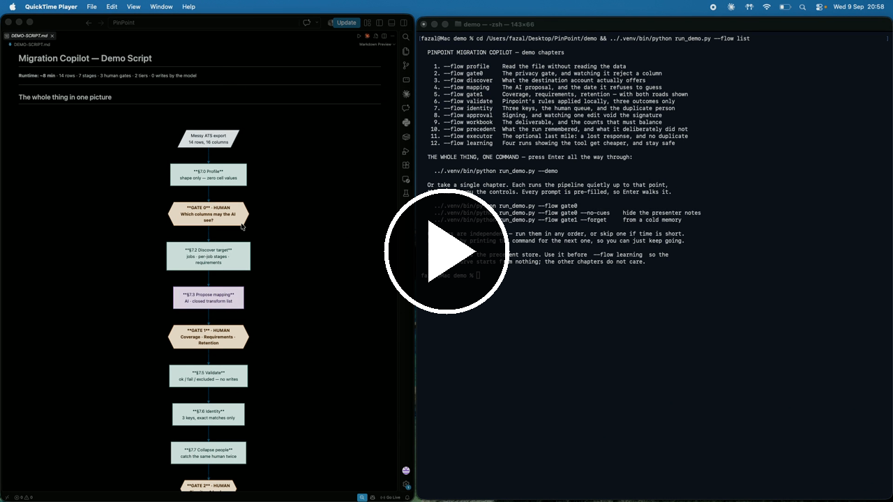
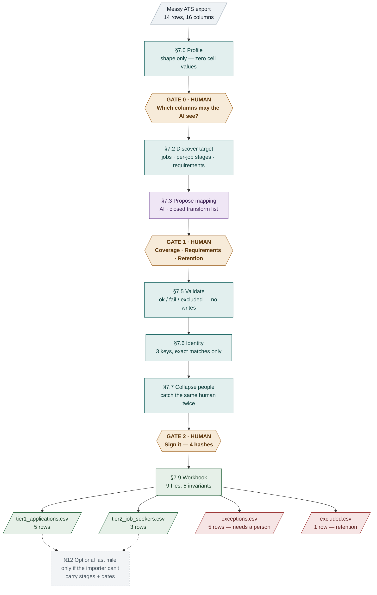
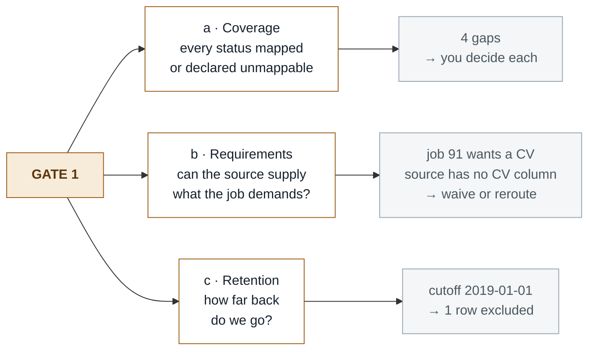
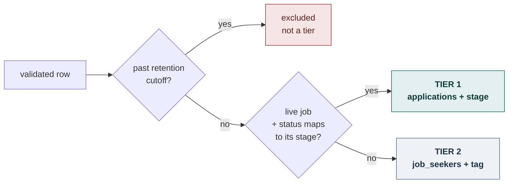
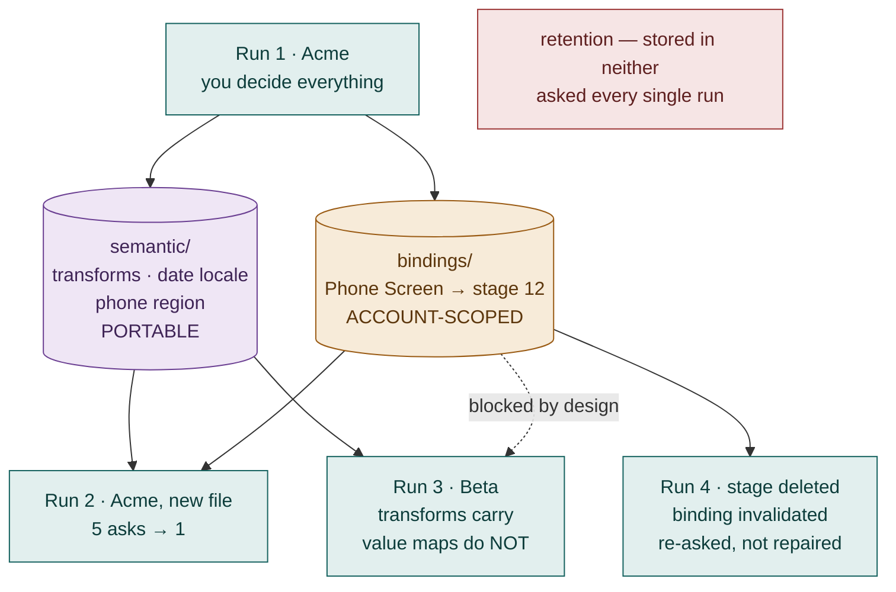

# Pinpoint Migration Copilot

A runnable vertical slice of an AI-assisted ATS migration tool. It walks a messy legacy
applicant export into a Pinpoint account through **seven stages, three human gates and a signed
approval**, and produces a migration workbook a human can import and sign for.

## Watch the full workflow

[](https://github.com/Fazal-Elahi/PinPointHQ/blob/main/PinPoint-Demo.mp4)

**[▶ Watch the full demo](https://github.com/Fazal-Elahi/PinPointHQ/blob/main/PinPoint-Demo.mp4)** — 24 minutes, one complete run: a messy 14-row CSV through all three gates to a signed workbook.

> **The one line that explains the design:** software does the reading, checking and counting;
> a human makes every decision that could be wrong in a way that matters.
>
> The model proposes. It never writes. Zero write payloads are issued by a model.

---

## 1 · Get the code

```bash
git clone https://github.com/Fazal-Elahi/PinPointHQ.git
cd PinPointHQ
```

No git? Use the green **Code ▾** button on GitHub → **Download ZIP**, then unzip it and `cd`
into the folder.

---

## 2 · Run it

Requires **Python 3.9 or newer**. Create the environment and install the one dependency:

```bash
python3 -m venv .venv
.venv/bin/pip install -r requirements.txt
```

Then run the walkthrough — **from the `demo/` folder**, because the scripts resolve
`fixtures/` and `../openapi/` relative to it:

```bash
cd demo
../.venv/bin/python run_demo.py --demo
```

Twelve chapters, one command. Every prompt is pre-filled, so you can press **Enter** the whole
way through.

Other ways to run it:

```bash
../.venv/bin/python run_demo.py --auto --reset   # no prompts, recorded answers
../.venv/bin/python run_demo.py --flow list      # pick a single chapter
../.venv/bin/python run_learning.py              # the four-run learning curve
```

`--auto` is also the CI-shaped check: it exits non-zero if any invariant fails.

<details>
<summary>Windows, and other flags</summary>

On Windows the interpreter lives at `.venv\Scripts\python.exe`, so use
`..\.venv\Scripts\python.exe run_demo.py --demo` from the `demo` folder.

| Flag | Effect |
|---|---|
| `--auto` | Recorded answers, no prompts |
| `--reset` | Clear `out/` and `workbook/` first |
| `--forget` | Wipe the precedent store (cold start) |
| `--no-execute` | Stop at the workbook; skip the optional §12 executor |
| `--no-pause` | Interactive gates, but don't pause between stages |
| `--no-cues` | Hide the dim presenter notes |
| `--source` / `--account` | Point at a different fixture |
| `--alt-retention` / `--alt-status` | Take a different road at Gate 1 |

</details>

---

## 3 · How it works

### The whole thing in one picture



### Gate 1 — coverage, requirements, retention



### Validate — three outcomes, never "warn and proceed"



### The learning loop



---

## The demo, chapter by chapter

Each chapter runs the pipeline quietly up to its own point, then hands you the controls. They
are independent — run them in any order.

```bash
../.venv/bin/python run_demo.py --flow gate0
```

| # | `--flow` | What it shows |
|---|---|---|
| 1 | `profile` | Read the file without reading the data |
| 2 | `gate0` | The privacy gate, and watching it reject a column |
| 3 | `discover` | What the destination account actually offers |
| 4 | `mapping` | The AI proposal, and the date it refuses to guess |
| 5 | `gate1` | Coverage, requirements, retention — with both roads shown |
| 6 | `validate` | Pinpoint's rules applied locally, three outcomes only |
| 7 | `identity` | Three keys, the human queue, and the duplicate person |
| 8 | `approval` | Signing, and watching one edit void the signature |
| 9 | `workbook` | The deliverable, and the counts that must balance |
| 10 | `precedent` | What the run remembered, and what it deliberately did not |
| 11 | `executor` | The optional last mile: a lost response, and no duplicate |
| 12 | `learning` | Four runs showing the tool get cheaper, and stay safe |

---

## Stage by stage

| Stage | Actor | What happens |
|---|---|---|
| §7.0 Profile | script | Shape, nulls, cardinality, PII class. **No cell values are emitted.** |
| **Gate 0** | **human** | Which columns may the model see *values* from? A tripwire rejects anything matching an email/phone/postcode/DOB pattern — and names the **column**, never the value. |
| §7.2 Discover | script | What the destination account actually offers: jobs, stages, requirements. |
| §7.3 Mapping | **LLM** | Proposes column → field mappings from a closed transform allowlist. The model never writes code. |
| **Gate 1** | **human** | Status coverage, requirement reachability, and retention. Every status must be mapped or explicitly declared unmappable. |
| §7.5 Validate | script | Pinpoint's write rules applied locally. Three outcomes only. No warn-then-proceed. |
| §7.6 Identity | script | Exact-match resolution on three keys. No fuzzy matching anywhere. |
| Queue | **human** | Ambiguous and conflicting identities. "Probably the same person" is a data-protection incident, not a convenience. |
| §7.7 Collapse | script | Two rows for one human must be ordered — a candidate exists only as a *side effect* of a create. |
| **Gate 2** | **human** | Sign the workbook. Pins four hashes; one edit to the mapping voids the signature. |
| §7.9 Workbook | script | Deterministic assembly. Five invariants must balance. |
| §8 Precedent | script | Capture what carries to the next run — and what deliberately does not. |
| §12 Executor | optional | The last mile against a mock: a lost response, a reconcile, and no duplicate. |

---

## Repository layout

```
├── api-topology.md              Topological map of the Pinpoint API — the three "person"
│                                surfaces, and why knowing which one you hold matters
├── api-contract-extract.json    Structured extract behind that map
├── openapi/
│   ├── pinpoint-openapi.json    Full reconstructed spec — 111 operations, 572 schemas
│   ├── milestone-1-slice.json   The contract the mock implements — 12 ops, all $refs resolved
│   └── provenance.json          Per-source-page URL + SHA256, to detect drift
├── demo/
│   ├── run_demo.py              The pipeline — seven stages, three gates
│   ├── run_learning.py          Four runs, showing the precedent store pay off
│   ├── fixtures/                Legacy exports + three target account shapes
│   ├── out/                     Model-visible artifacts (counts, codes, hashes)
│   └── workbook/                The deliverable — nine files
└── precedents/
    ├── semantic/                Portable: describes the source file
    └── bindings/                Account-scoped: never offered to another tenant
```

**The private lane.** `demo/out/` and `demo/workbook/` are not the same kind of thing.
Everything holding row-level PII lives in the private lane; `manifest.json` carries counts,
error codes and hashes only, and is the one file a model is allowed to read. A verdict never
carries a value.

---

## Status and limits

- **Not an official Pinpoint artifact.** The OpenAPI documents are reconstructed from public
  documentation pages retrieved 2026-09-09, not published by Pinpoint.
- **Not live-validated.** No authenticated request has been made against any Pinpoint account.
  A documented schema is evidence of the public contract, not proof of production behaviour.
- The §12 executor runs against an **in-process mock**, not the real API.
- Milestone 1 covers **Tier 1 (applications) and Tier 2 (job_seekers) only**, against jobs that
  already exist. It does not create jobs, workflows or custom fields.
- One open question is acknowledged at Gate 2 rather than papered over:
  `skip_notifications_on_create` is documented for `applications` but absent from the
  `job_seekers` request schema, so notification behaviour on that surface is recorded as
  **unknown**. A real run would begin with a canary of one create and halt for human
  confirmation.
- All fixture data is synthetic.
